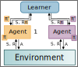
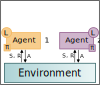

+++

title = "Neighbor-Based Decentralized Training Strategies for Multi-Agent Reinforcement Learning"
description = "Presentation SAC 2025 - Machine Learning and its Applications"
outputs = ["Reveal"]
aliases = [
    "/guide/"
]

+++

## Neighbor-Based Decentralized Training Strategies for
## Multi-Agent Reinforcement Learning

[Nicoló Malucelli](mailto:nicolo.malucelli1@gmail.com),
[Davide Domini](mailto:davide.domini@unibo.it),
[Gianluca Aguzzi](mailto:gianluca.aguzzi@unibo.it),
[Mirko Viroli](mailto:mirko.viroli@unibo.it)

ACM Symposium on Applied Computing @ SAC 2025, MLA Track

 

---

# Multi-Agent Reinforcement Learning

 

---

# MARL Examples

{}

{}

{}

<!-- {}

{} -->

{}

{}

{}

--- 

# MARL Formalization

 
 

{}
- In this paper, we consider *partially observable networked markov decision process* <small>[1]</small> as a tuple $(\mathcal{G}, \mathcal{S}, \mathcal{A}, \mathcal{O}, \mathcal{P}, \mathcal{R}, \gamma)$
<!-- - *SwarMDP* is an extension of the classical *Markov Decision Process* (MDP) model, suitable for Many-Agent RL -->
{}
<!-- {}
- Formally, a SwarMDP is a tuple of a *swarming agent $\mathbb{A}$* and an *environment $\mathcal{E}$*
{} -->
{}
- Where:
    - $\mathcal{G} = (N, E)$ is a *communication graph*, where $N$ is the set of $n$ *agents* and $E \subseteq N \times N$ represents the *communication links* between agents. Time-varying graphs $\mathcal{G}_t = (N, E_t)$ can be used to represent communication evolving over time $t$.
    - $\mathcal{S}$ is the *global state space*.
    - $\mathcal{A} = \mathcal{A}^1 \times \dots \times \mathcal{A}^n$ is the *joint action space*, where $\mathcal{A}^i$ is the *action space of agent* $i$.
    - $\mathcal{O} = \mathcal{O}^1 \times \dots \times \mathcal{O}^n$ is the *joint observation space*, where $\mathcal{O}^i$ is the *observation space for agent* $i$.
    - $\mathcal{P}: \mathcal{S} \times \mathcal{A} \times \mathcal{S} \to [0, 1]$ is the *state transition function*, describing the probability of transitioning to a new state $s' \in \mathcal{S}$ given the current state $s \in \mathcal{S}$ and joint action $a \in \mathcal{A}$.
    - $\mathcal{R} = \{\mathcal{R}^i\}, {i \in N}$, where $\mathcal{R}^i: \mathcal{S} \times \mathcal{A} \to \mathbb{R}$ is the *reward function* for agent $i$.
    - $\gamma \in [0, 1]$ is the *discount factor*.
{}
<!-- {}
- The environment $\mathcal{E}$ represents the world in which the agent operates, and is defined by:
    - $\mathcal{P}$ is the *number of agents* in the system
    - $\mathbb{A}$ is a prototypical agent *defining properties* common to all agents
    - $\mathcal{T}: \mathcal{S^\mathcal{P}} \times \mathcal{A}^\mathcal{P} \times \mathcal{S^\mathcal{P}} \rightarrow \mathbb{R}^\mathcal{P}$ is the *global transition function*, determining the evolution of the system's state based on the current states and actions of all agents
    - $\xi: \mathcal{S^\mathcal{P}} \rightarrow \mathcal{O}^\mathcal{P}$ is a function *mapping the state of all agents to the corresponding observations* available to each agent
{} -->

<small style="text-align: left; margin-top: 120px;"> 
[1]  Sachin Adlakha, Sanjay Lall, and Andrea Goldsmith. 2012. Networked Markov Decision Processes With Delays. IEEE Trans. Autom. Control. 57, 4 (2012), 1013–1018.
</small> 

--- 

# Learning and Execution Strategies

 
 

{}

{}

<h2> CTDE <h2>

{}

<!-- {}

{} -->

{}

<h2> DTDE <h2>

{}

{}

---

# Motivation

--- 

# Neighboring-Based Distributed Learning Strategies

--- 

# Evaluation

--- 

# Conclusion and Future Works